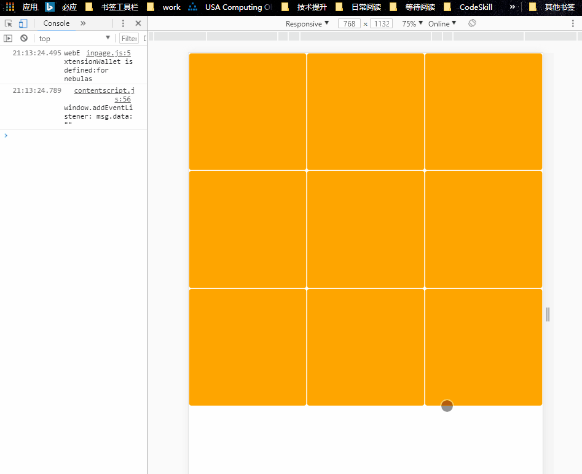
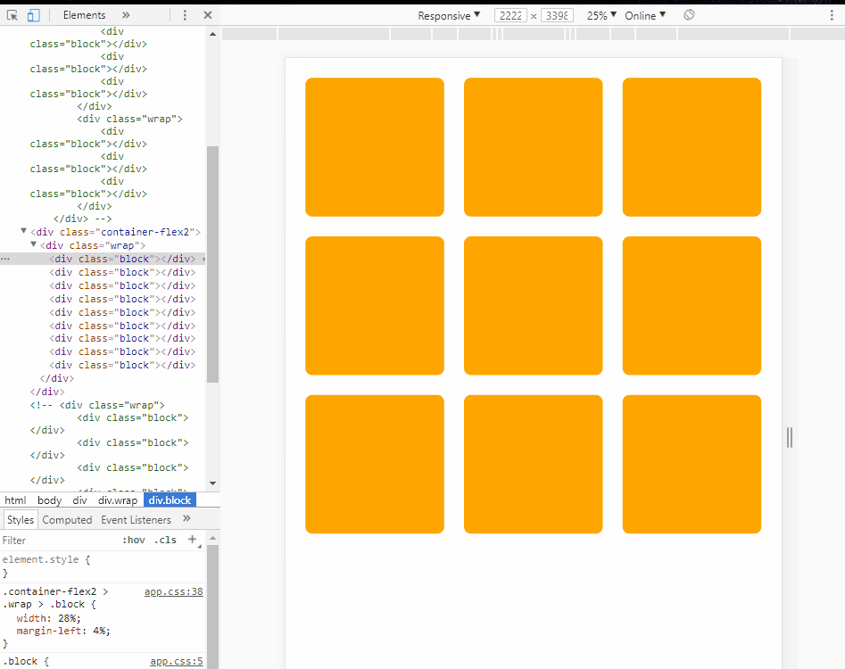

# 任务1:九宫格——用html+css制作一个网页

## 任务描述：

### 1.最终效果：

### 2.效果描述

圆角橙色九宫格，自适应页面大小

### 3.开发计划

#### 3.1 开发

- [x] index.html建九个div.block
- [x] app.css设定block大小颜色圆角横排
- [x] 寻找自适应方法
  - 重点：
    - div大小随屏幕变化
    - 令block的高度等于宽度
  - [x] 猜想：block父级宽度跟随屏幕变化，block始终为父级30%左右
    - [x] 方案一：Flex布局
      - 步骤:
        1. 简单分三行div.wrap(display:flex)，各带三个div.block(flex:1)，宽度自适应成功
        2. 将div.block高度自适应宽度,根据这篇文章[padding-top百分比值参考容器宽度](http://www.cnblogs.com/linguoguo/p/4942034.html)，可以尝试使用padding-top来为div.block顶出高度，但是这种写法div.block的margin只能很小，否则在小屏幕上会变成长方形
            - 效果：已实现
            
            - 代码：见div.container-flex
            - 特点：flex对移动设备适配好
        3. 步骤2中margin只能用很小数值的处理，根据任务要求最终的页面应该是九宫格，方块和方块间有间隔，方块和容器也有间隔，所以横纵的设计应该是用凑100%容器宽度的方法：
            - margin(1%) + 方块(32%) + margin(1%) + 方块(32%) + margin(1%) + 方块(32%) + margin(1%) = 100%
            - margin(4%) + 方块(28%) + margin(4%) + 方块(28%) + margin(4%) + 方块(28%) + margin(4%) = 100%

            按照这个设计来使用百分比,使用first-child & last-child伪类来完善布局.效果如下：
            .gif)
    - [x] 方案二：Flex布局2
      - 步骤：
        1. 方案一用了flex，但是那种用flex:1之前还要把div分三行再均等分，还要额外做margin处理，烦透. 学习[阮一峰-Flex语法篇](http://www.ruanyifeng.com/blog/2015/07/flex-grammar.html)后，尝试div.wrap使用默认横排flex & flex换行 & justify-content:space-around, div.block设定百分比宽度，轻松实现目标效果
            - 效果：
            
- [x] Chrome自适应效果调试
- [x] 装Node.js开http-server开端口给手机看

#### 3.2 完成任务之后

- [x] A. **验收标准**
  1. [x] 还原设计图
    - [x] 圆角：10%
    - [x] 颜色：换windows取色,#FFA600
    - [x] 设计图：基本一致
  2. [x] 自适应：宽度无滚动条，格子随窗体变化
  3. [x] 移动端：Chrome响应式测试和真机均通过
  4. [x] 编码规范
    - [x] UTF-8: <meta>的charset默认UTF-8
    - [x] 标签小写 & 闭合
    - [x] 元素属性值已用双引号包含
    - [x] css外联引用
    - [x] css不用id控制样式
    - [x] 用div实现布局

- [x] B.**深度思考**
  1. Doctype作用： 声明解析器
  2. 盒模型理解：用东西放在盒子中来类比元素在网页中的显示效果。
    - content: 物品，存储于海绵(padding)的包裹中，并由箱子(border)包装; 
    - padding: 类比用来包裹贵重物品的海绵，最靠近物品(content)，在箱子(border)里面;
    - border: 箱子。箱子大小厚度可调整，箱子会被物品(content)及其海绵(padding)撑大;
    - margin: 箱子要求与其他东西保持的距离，处于最外层;
  3. display:
    - inline:
      - 行内元素，文本元素一般都是，两个inline元素连续写，其显示效果不换行;
      - 修改width & height无效， 可以通过修改line-height来改变高度，内容撑开宽度;
      - 代码换行被解析为空格
      - 不支持样式：width&height、text-align、background-position、clear
    - block: 
      - 块状元素，div是其代表。一个块状元素会新开始一行并尽可能撑满容器;
      - 可通过修改width & height 来修改宽高;
      - 不支持样式：
        - vertical-align
    - inline-block：
      - 行内块元素，兼具block和inline特性,可通过修改width&height来修改宽高,且不独占一行;
      - 代码换行被解析为空格
    - none: 在不删除元素的情况下show|hide元素;
  4. 使用浏览器的F12调试界面方法 [【调试】chrome谷歌浏览器-DevTool开发者工具-详细总结](http://www.cnblogs.com/Nirvana-zsy/p/7081063.html#m26)
    - Element：查看界面元素，可查看元素的对应css样式、计算后样式、事件监听器、属性.
    - Console: 控制台。用于显示日志信息及输入一些命令.
    - Network：请求监听。可获得请求列表，点开某一项将看到Headers、Preview、Response、Timing数据.
      - Headers: 头部数据。包含General、Response Heaeder、Request Headers
        - General：本次请求的URL、请求方法、状态码、请求服务器的地址、其他一些设置.
        - Response Headers: 响应头部.
        - Request Headers: 包含用户代理User-Agent，帮服务器识别设备用.
      - Preview： 预览。如果是图片html将直接显示界面，如果是数据则以其格式优化后展示，如果是代码则直接展示.
      - Response: 响应结果原始数据.
      - Cookies(有些有)：请求用到的cookies.
      - Timing: 请求时间使用情况.
    - Sources: 看代码 & 开断点.
    - Performance: 网页加载时记录情况, 帧数、CPU资源，据此可提出性能优化点;
    - Memory: 分析开销大的js函数
    - Application: 应用资源面板。存储LocalStroage、Session、Cookies等.
    - Security: 网页安全情况.
  5. 九宫格布局其他方法实现及其优劣
    - 九宫格布局 [在 CSS 中，用 float 和 position 的区别是什么？](https://www.zhihu.com/question/19588854)
      - float: 
        - 优点：浏览器兼容性好
        - 缺点：不是一种真正的布局方式。比较trick, 问题也比较多(移动端)
      - 当前使用的flex布局：
        - 优点：flex是真正的布局方式。移动设备友好，微信小程序也用flex做布局
        - 缺点：浏览器兼容性(支持IE10+)
    - block正方形化 [移动端布局，div按比例布局，宽度为百分比，但又想让高度和宽度一样，即让div为正方形，怎么做布局呢？](https://www.zhihu.com/question/31753528)
      - vw & vh: 移动设备兼容性存在问题
      - 当前使用的padding-top：简单，兼容性好
  6. IDE意思 & 与文本编辑器的对比（后者被前者集成）
    - IDE(Integrated Development Environment)即集成开发环境，提供程序开发环境，一般集成了代码编辑器、编译器、调试器以及图形化用户界面。具有丰富的工具和流畅的开发体验。
    - 文本编辑器：单纯进行编辑用的应用。代码型的一般具有插件扩展功能。
  7. 加不加<meta>的viewport的区别 [Responsive Web Design - The Viewport](https://www.w3schools.com/css/css_rwd_viewport.asp)
    - 加<meta>的viewport:
      - width=device-width 将会一直帮你根据屏幕宽度设置界面宽度
      - initial-scale=1.0  将会在浏览器首次加载页面的时候帮你设置好页面缩放比例
    - 不加：
      - 无论什么设备显示效果都是一样的，移动设备上的页面可能会被等比例缩小到看不清

### 4. 上线

- 购买服务器，选用CentOS7
- 学习安装Nginx
- 将工程放到/usr/share/nginx/html目录下

### 5. 效果

- Github: [cssup](https://github.com/Nodreame/cssup)
- 线上展示： [Task1-9blocks](http://118.89.44.244/cssup/task1-9blocks/index.html)
- Readme.md下载: [Readme](http://118.89.44.244/cssup/task1-9blocks/Readme.md)
- 文章：[\[CSS练习\]IT修真院--练习1-九宫格](https://segmentfault.com/a/1190000015104917)