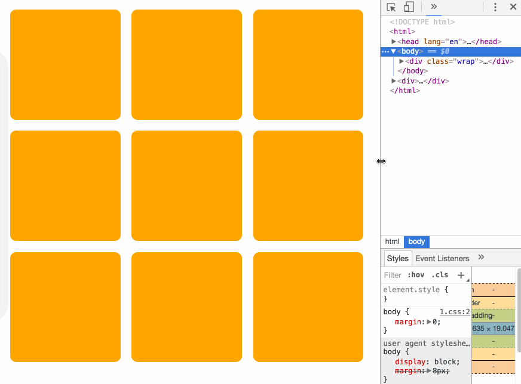

# 任务1:九宫格——用html+css制作一个网页

## 任务描述：

### 1.最终效果：

### 2.效果描述

圆角橙色九宫格，自适应页面大小

### 3.开发计划

- [x] index.html建九个div.block
- [x] app.css设定block大小颜色圆角横排
- [ ] 寻找自适应方法
    - 重点：
        - div大小随屏幕变化
        - 令block的高度等于宽度
    - [ ] 猜想：block父级宽度跟随屏幕变化，block始终为父级30%左右
        - 方案一：Flex
            - 步骤: 
                1. 简单分三行div.wrap(display:flex)，各带三个div.block(flex:1)，宽度自适应成功
                2. 将div.block高度自适应宽度,
                    - 根据这篇文章[padding-top百分比值参考容器宽度](http://www.cnblogs.com/linguoguo/p/4942034.html)，可以尝试使用padding-top来为div.block顶出高度，但是这种写法div.block的margin只能很小，否则在小屏幕上会变成长方形
            - 效果：已实现，见div.container-flex
            - 特点：flex对移动设备适配好
- [ ] Chrome自适应效果调试
- [x] 装Node.js开http-server开端口给手机看