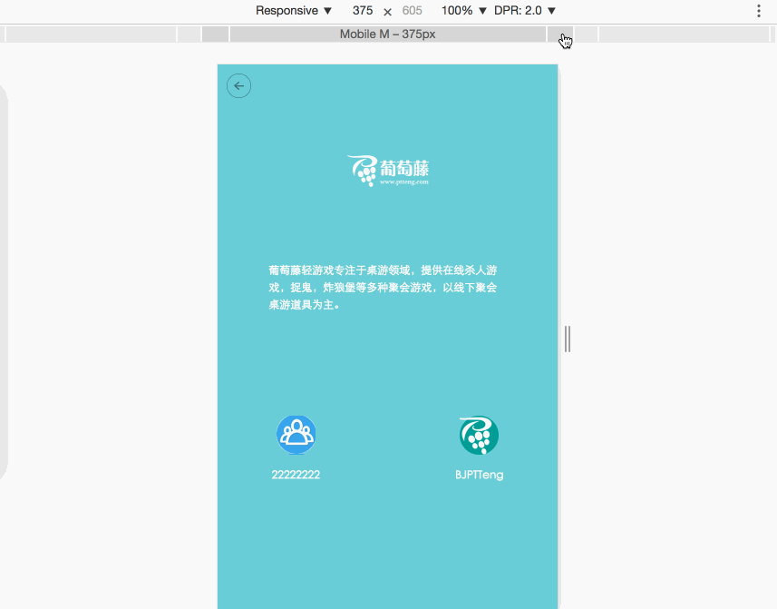
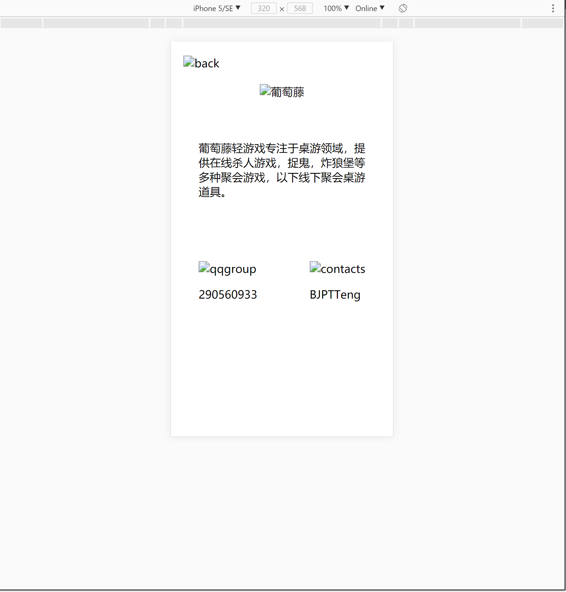
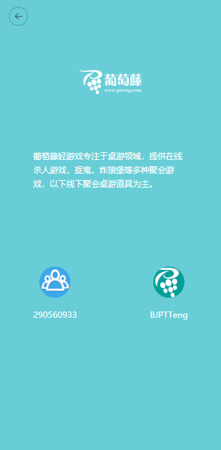
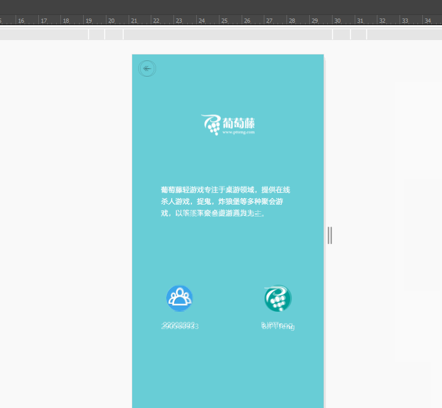
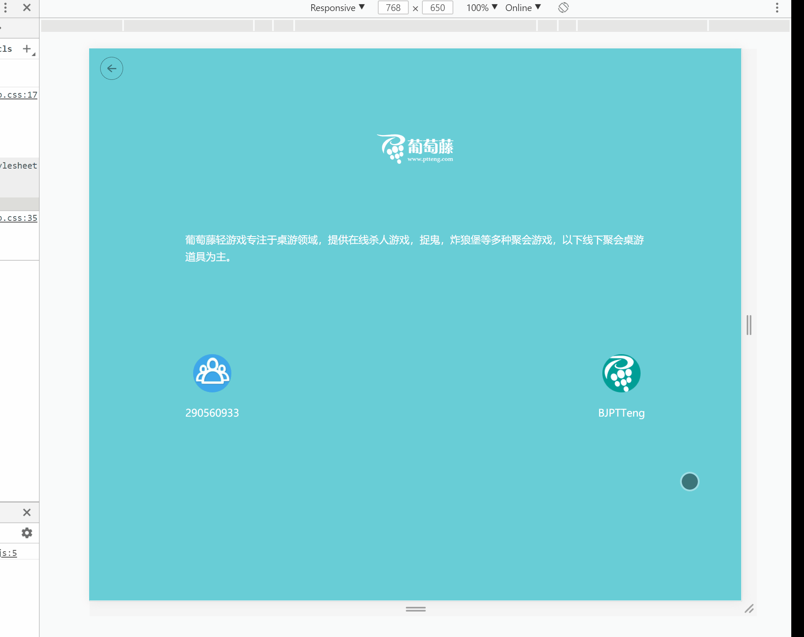

# 任务三、 一个最简单的移动端页面

## 今天完成的事情

1. 运用布局知识跟随设计图进行布局，完成简单Demo并继续学习优化.
2. 让布局更好适应屏幕变化(使用了盒模型及百分比).
3. 了解rem&em&px区别 & 在Demo中应用rem.
4. 图片处理学习.

## 明天计划的事情

- [ ] 深度思考：手机分辨率和网页px的区别(TODO:周末补学)
  - [link1](http://www.cnblogs.com/yaozhongxiao/archive/2014/07/14/3842908.html)
  - [link2](https://jingyan.baidu.com/article/22a299b52586cd9e19376aa9.html)
  - [link3](http://hax.iteye.com/blog/374323)
- [ ] 任务四计划及简单编写

## 遇到的问题

- 暂无

## 收获

1. 运用布局知识进行更复杂的布局，完成简单Demo，找出不足继续学习优化
  - 借助盒模型完成布局
    - 明确目标：
  
    - 编码
      - 设计图尺寸为640\*1136,于是在浏览器选择相同比例的iPhone5/SE(320\*568)进行模拟
      - 新建index.html并编写简单布局div及css，将页面纵向分为topbar&container两个部分, 其中topbar包含着后退按钮，container包含title、content、contact三个部分. 接着通过在PS界面上画参考线方法，简单获得页面各部分比例，并以此为依据完善CSS，效果如下图所示:
      
      - 在PhotoShop中找到图层工作区，找到将要用到的素材点击右键-快速导出为PNG(由于有素材图所以不需要使用切图工具)，并用吸管工具获取背景颜色，再在拾色器(前景色)获取背景色#68cdd6
      - 接下来将图片素材引入index.html中，调整图片长宽
      - 截取效果图GIF的320*650来与当前Demo做对比(吐槽一下这跟PSD图不一样呀=。=)
      
      

2. 让布局更好适应屏幕宽度变化
  - 先尝试对刚才写的Demo应用屏幕改变的效果
    - 425px&768px的效果图与现在对比
      - 后退按键与title变化不大
      - container的左右margin过小
      - contacts的顶部margin过小
    - 修改
      - 将container左右margin改为百分比
      - 将context和contacts中间改为margin和padding的组合
      - 结果：基本完成与设计图的重合
  
3. 了解rem & em & px & % & vw & wh & vm的区别
  - 参考：
    - [CSS3的REM设置字体大小](https://www.w3cplus.com/css3/define-font-size-with-css3-rem)
    - [rem与em的使用和区别详解](http://caibaojian.com/rem-vs-em.html)
    - [视区相关单位vw, vh..简介以及可实际应用场景](http://www.zhangxinxu.com/wordpress/2012/09/new-viewport-relative-units-vw-vh-vm-vmin/)
  - 1)px：相对长度单位，相对于屏幕的分辨率.
    - 特点：
      - 优点：稳定 & 精确
      - 缺点：改变浏览器字体大小，布局会被打破
    - 作用：
      - 给定具体大小，协助em和rem重写具体单位
  - 2)em：相对长度单位，相对于当前元素的文本尺寸,如果当前元素文本尺寸未设置则相对于浏览器默认字体尺寸
    - 计算公式：targetEM = 1 / parentPX * targetPX;
    - 特点：
      - 1.em值不固定; 2.会继承父类字体大小
      - 缺点：如果不重新计算已被放大字体的em值的话，各层设置的字体大小复合会导致连锁反应,这个连锁反应是'继承'导致的，想要避免继承的连锁反应可以在目标元素上显式设置px单位的font-size来停止继承.
      - 总结：em对应px的值取决于其使用字体的大小，此字体大小受父类继承过来的大小影响，除非显示重写一个具体单位.
    - 作用：
      - 允许保持在一个特定的设计元素范围内的可扩展性(应在标识清除的情况下使用em单位)
  - 3)rem(root em)：相对长度单位,只相对于HTML根元素
    - 特点：
      - 优点：只需修改根元素大小就可以成比例地调整所有字体大小,且避免了字体大小逐层复合的连锁反应，且IE8+的浏览器都支持
      - Tip：为应对不支持的浏览器,可以多写一个绝对单位的声明，例如：
      ``` css
      p {font-size:14px; font-size:.875rem;}
      ```
      - 总结：rem对应px的值取决于html元素字体大小，此大小会被浏览器中字体大小的设置影响，除非显示重写一个具体单位.
    - 作用：
      - 保证无论用户如何设置自己的浏览器，布局都能调到合适大小
      - 维护用户拥有自己体验偏好的权利
  - 4)%
    - 特点：
      - 普通元素的百分比定位基于父类.
      - 设置了position: fixed的元素的百分比定位基于浏览器窗体.
      - 设置了position: absolute的元素的百分比定位相对于static定位以外第一个父元素进行定位.
    - 作用：
  - 5)vw(viewport width, viewport指的是浏览器内部可视区域大小)
    - 特点：
      - 计算： 1vw = 1% * width_viewport
  - 6)vh(viewport height)
    - 特点：
      - 计算： 1vh = 1% * height_viewport
  - 7)vm(viewport min)
    - 特点：
      - 计算： 1vm = 1% * (width<height?width: height)
  - 实际使用：
    - 元素**严格不可缩放**时，使用px
    - 一切可扩展都应该用rem, 包括媒体查询
    - 千万不要用em控制字体的大小
    - em用于缩放一些没有默认字体大小的元素，当字体变大整个组件也能随之变大
    - 多列布局用%较好
    - vw、vh、vm做页面排版很厉害，但是**兼容做得比较晚**，所以优先还是用rem和%解决问题
  - 在task3中应用rem.(已完成)
4. 深度思考
  - 如何从UI图中获取所需信息（使用Photoshop）参考：[前端工程师技能之photoshop巧用系列](http://www.cnblogs.com/xiaohuochai/p/4770584.html)
    - 终极目标：[视觉设计师是怎样让前端工程师 100% 实现设计效果的](https://www.zhihu.com/question/27743708)
    - 页面大致布局获取: 视图-标尺，视图-新建参考线，将页面分块大致确定布局；
    - 字体获取: 左侧栏-文字工具，点击目标文字查看字体属性
    - 图片获取:
      - 图层中有现有素材: 选中所需图层，右键快速导出为PNG
      - 图层中无现有素材: [前端工程师技能之photoshop巧用系列第三篇——切图篇](http://www.cnblogs.com/xiaohuochai/p/4793240.html)
    - 颜色获取：左侧栏-吸管工具，然后在拾色器中获取颜色值
  - 如何进行自适应网页设计 参考：[自适应网页设计（Responsive Web Design）](http://www.ruanyifeng.com/blog/2012/05/responsive_web_design.html)
    - 允许网页宽度自动调整 ```<meta name="viewport" content="width=device-width, initial-scale=1" />```
    - 不使用绝对宽度布局，多用%和auto
    - 字体多用rem
    - 使用流式布局，谨慎使用绝对布局
    - 使用媒体响应
    - 根据屏幕大小加载图片
  - margin和padding使用时机：根据盒模型,padding是盒子内部填充物,margin是盒子与其他物品保持的距离，所以用padding来扩充(撑大)盒子，用margin来保持距离
  - css选择器优先级 参考:[优先级-CSS：层叠样式表](https://developer.mozilla.org/zh-CN/docs/Web/CSS/Specificity)
    - 从上到下优先级递增：
      - 对优先级无影响：通配符选择器(*) & 关系选择符(+,>,~) & 否定伪类(:not())
      - 类型选择器(h1) & 伪元素(::before)
      - 类选择器(.btn) & 属性选择器(type="radio") & 伪类(:hover)
      - ID选择器(#navbar)
      - 内联样式(style)
      - 覆盖任何声明：!important
