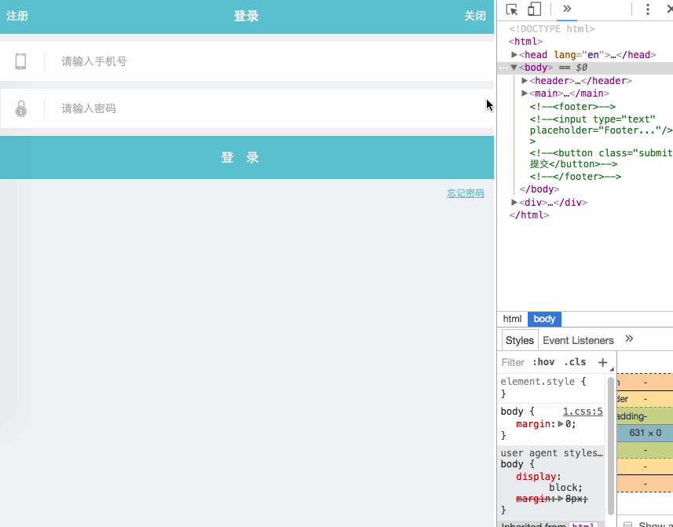
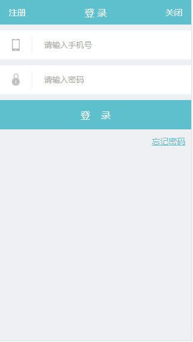
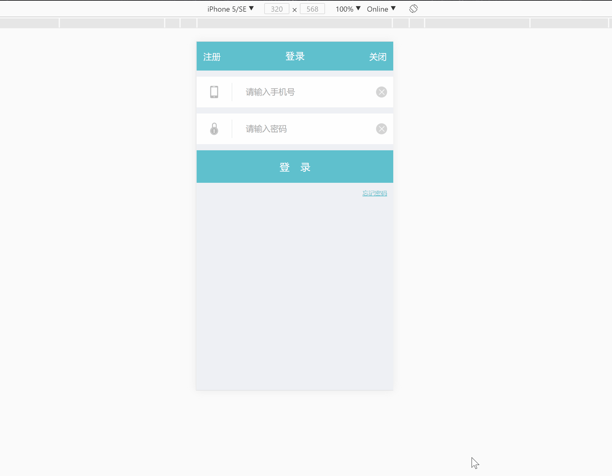
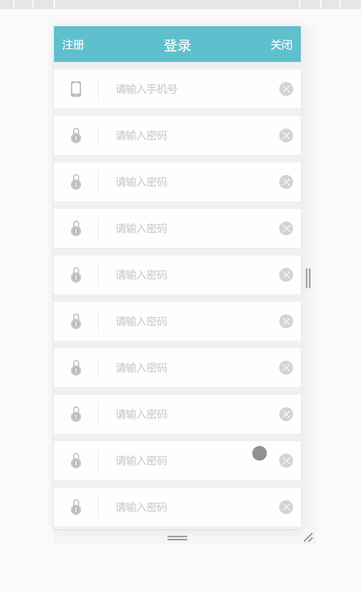

# 任务四、 一个最常见的移动端页面

## 今天完成的事情

1. 完成简单布局，然后填充界面
2. 与效果图对比优化
3. 完成验收要求：header扩展性 & 顶栏固定
4. 进行placeholder样式兼容性研究

## 明天计划的事情

- [ ] 任务四-深度思考
- [ ] float深入学习
  - [ ] 张鑫旭《CSS世界》相关章节
  - [ ] 张鑫旭 float系列
- [ ] 深度思考：手机分辨率和网页px的区别(TODO:周末补学)
  - [link1](http://www.cnblogs.com/yaozhongxiao/archive/2014/07/14/3842908.html)
  - [link2](https://jingyan.baidu.com/article/22a299b52586cd9e19376aa9.html)
  - [link3](http://hax.iteye.com/blog/374323)

## 遇到的问题

- FireFox60下placeholder样式修改失效
  - input:-moz-placeholder(失效)
  - input::-moz-placeholder(失效)
  - input:placeholder-shown(失效)

## 收获

### 一、 布局 & 优化

1. 明确效果：一个宽度自适应屏幕的登录界面
    
2. 步骤:
  - 1).对目标效果GIF进行截图，获得全屏效果图、425px效果图、320px效果图
  - 2).从PSD文件中导出需要的图片(phone&lock)，并用吸管工具获取界面背景色#eff0f4、登录按钮底色#5fc0cd、input中间小杠颜色#eaedee
  - 3). 开始简单界面编写
    - a. 首先是topbar, 关闭登录注册，分成三列，关闭靠左登录居中注册靠右
      - 布局：可以用float解决靠左靠右剩下一个在文档流中居中，不过按照惯例要走新一点的路，所以这里选择使用flex布局，topbar类设置justify-conent: space-around，也就是**两端对齐，项目间间隔相等**的主轴对齐方式.再设置align-items: center使三个项垂直居中.
      - 调整：
        - topbar中的文字里边有距离，这里应该用padding做填充撑起外盒，还没有测量，可以先这是html的font-size再用rem做padding填充.
        - 关闭登录注册刚开始用的是三个\<a\>标签,并且做了个去底线处理,但是中途发现登录是个title而不是链接，故筛选大小后暂时先选用\<h3\>.
    - b. 然后是container-form两个各占一行的输入：
      - 布局：由于是左icon右input的布局，所以用flex，并且这是主轴靠左，input设flex:1，完成大致布局.
      - 左侧icon：有图片做icon右边有输入栏，由于icon是图片并且有近似等高的同行小杠杠，于是设计图片左右padding+右侧border，看原型图发现右侧小杠杠似乎稍高，于是图片上下也设置一点padding来撑高右侧小杠杠，之后外面用一个div包住设置margin和行高来居中，完成左侧；
      - 右侧input:简单设置一下padding并去掉border&outline就好，在此顺便对placeholder的样式做一点探究(见下面总结)
    - c. 接着是container-form的button, 由于button的display是inline-block所以可以控制width,设置为100%,然后设置上下padding.然后"登录"之间有一个字左右的间距所以加上\&nbsp;
    - d. 最后是forgetpw,包含文字并且靠右,继续用flex,主轴flex-end，交叉轴center.设置好a标签的颜色样式

      
3. 对比优化
  - 对比
    - topbar高度不够,左右padding稍宽,登录字体不一样
    - 输入左侧icon的横向padding加一点,行高加一点
    - 登录高度不够.效果图"登录"应该是用letter-spacing做间隔的导致没居中(这个不改哈哈)
    - 忘记密码字体过大
    - GIF效果图没有做点击input显示"圆圈+x".
    - 处理：这个裁剪下PSD的图然后简单设置一下就可以简单加入输入行了.flex大法好!
  - 完成之后效果如下：
      

### 二、验收标准

1. 扩展性要求：去掉header的三块文字的任意一两个，剩下的一两个都还在原位置上不会受到影响
  - 一开始用的是flex三列布局，三个标签按照flex的justify-content: space-between;等距离分成左中右，纵向按照align-items: center;垂直居中，但是这样的样式去掉一个标签布局就会变化，去掉标签的话需要用等长的\&nbsp;来顶上才能保持标签位置不变.
  - 为了满足扩展性要求，将header改为左右float中间正常居中样式，但是实测发现浮动的a标签会占位导致中间的标签不居中(span内联包围了float),所以暂时放弃这个方案，并计划找时间学习float看看有无解决方法.
  - 根据上面方法进行修改，左右使用absolute，中间不变,轻松搞定...
2. 移动端：header始终固定顶部
  - 解决：header加fixed,给定width并设置top,完成.
  - 效果：
    

### 三、探究input标签的placeholder样式

- 结果如下

  ``` css
  /* Webkit浏览器支持(非标准) https://developer.mozilla.org/zh-CN/docs/Web/CSS/::-webkit-input-placeholder */
  .form-raw input::-webkit-input-placeholder {
    color: #aaa;
  }
  /* Chrome:57+已支持去前缀 https://www.chromestatus.com/feature/6715780926275584 */
  .form-raw input::placeholder {
    color: #aaa;
  }
  /* IE10+支持  https://developer.mozilla.org/zh-CN/docs/Web/CSS/:-ms-input-placeholder */
  .form-raw input:-ms-input-placeholder {
    color: #aaa;
  }
  /* Firefox 4-18 */
  .form-raw input:-moz-placeholder {
    color: #aaa;
  }
  /* 很奇怪， FireFox60实测不支持 */
  /* Firefox 19+(非标准) https://developer.mozilla.org/zh-CN/docs/Web/CSS/::-moz-placeholder*/
  .form-raw input::-moz-placeholder {
    color: #aaa;
  }
  /* 实验中特性 https://developer.mozilla.org/en-US/docs/Web/CSS/:placeholder-shown */
  .form-raw input:placeholder-shown {
    color: #aaa;
    /* border: 2px solid red; */   /* border有效并且只有在Firefox有效*/
  }
  ```