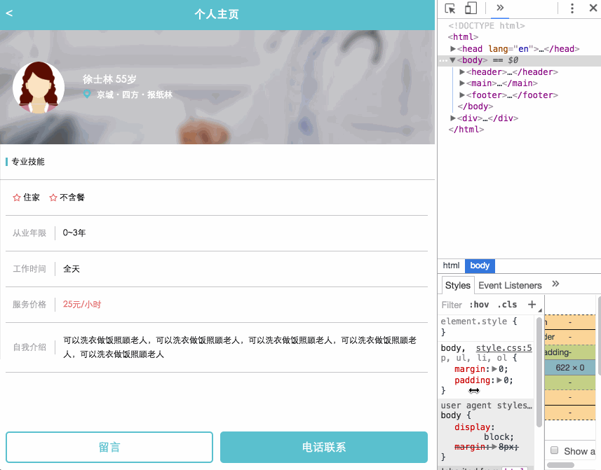

# 任务五、 一个最常见的移动端页面

## 今天完成的事情

1. float学习
  - 张鑫旭《CSS世界》相关章节
  - 张鑫旭 float系列
2. 了解CSS通配符 & 选择器性能优化/浏览器渲染原理
3. 任务五计划及完成一部分
4. background学习(各属性及效果)

## 明天计划的事情

- [ ] 完成任务五
- [ ] 找时间把前面任务的官方提供链接过一遍，查缺补漏
- [ ] CSS编码规范学习[CSS编码规范](https://github.com/fex-team/styleguide/blob/master/css.md)
  - [ ] 并按照编码规范优化代码
- [ ] 深度思考：手机分辨率和网页px的区别(TODO:周末补学)
  - [link1](http://www.cnblogs.com/yaozhongxiao/archive/2014/07/14/3842908.html)
  - [link2](https://jingyan.baidu.com/article/22a299b52586cd9e19376aa9.html)
  - [link3](http://hax.iteye.com/blog/374323)

## 遇到的问题

- [ ] IE10下自我介绍一行右侧无法自动自动换行(flex).

## 收获

### 一、任务五计划及开发

1. 明确效果：目标是开发一个屏幕自适应的护工个人主页，最终效果如下：
    
2. 开发步骤
  - 截取效果图 & 通过PSD中获取资源图 & 获取header底色#5fc0cd、价格颜色#e26163
  - 界面组成分析：
    - header： header用display:fixed，左侧后退+居中title，可用float或absolute解决. 为了实现灰色半透明层效果需加多一层div.transparent
    - main: 按照上节的学习为了防止移动端fixed出Bug，main也用position:absolute然后再在main中使用一个div.content来承载内容并支持滚动.
      - info: 定高，图片做背景，左边图片浮动并设置margin,右边用overflow:hidden清除浮动完成定位.
      - skill: title栏左border，condition栏使用flex左靠，接下来都用flex包含label+span来完成
    - footer: footer用display:fixed, 两个btn高度不变自适应屏幕宽度可用flex解决,为了保证伸缩3个margin不变故margin用rem写.
  - 效果对比：
      
3. 对比优化
  - TODO: 学习背景图知识并尝试实现背景图效果
  - 技能高度每行都减少
  - 底部button高度提高,并取消纵向margin
  - footer加入padding

### 二、CSS及浏览器部分探究

1. float学习 参考：张鑫旭《CSS世界》

- 学习总结
  - float本质: 本质是为了实现文字环绕效果. 因此在界面布局方面只是简单堆叠的话会造成**弹性缺失**.
  - float特性
    - 包裹性： "包裹" + "自适应性"
      - 包裹：float元素的子元素如果宽度更小，则float元素宽度将表现为其子元素宽度
      - 自适应性：float元素的子元素旁若有文字，则将自适应为子元素+文字宽度(非连续长串英文情况下，最大宽度为float元素宽度)
    - 块状化并格式化上下文：若float属性值不为none，则其display计算值为block或者table.
    - 破坏文档流（文字环绕图片效果实现原理）:
      - 场景描述：场景代码如下，img可添加float:left属性触发文字环绕效果，p元素为块状盒子，可能被分为多行，每行的文字都处于一个内联盒子中.
        ``` html
        <div class="father">
          
        </div>
        <p class="animal">啦啦啦啦啦啦啦啦啦啦啦啦啦啦啦啦啦啦啦啦啦啦啦啦啦</p>
        ```
      - 让父元素高度塌陷：让跟随的内容(文字)可以和浮动元素(图片)在一个水平线上
      - 行框盒子和浮动元素的不可重叠性：
        - 行框盒子(每行内联元素所在的盒子)被float限制故和浮动元素(图片)完全不重叠，且永远无法通过CSS改变大小.
        - 块状盒子(内联元素上级盒子)与浮动元素(图片)完全重叠，
  - 抗浮动
    - 结合任务四的header布局实现实例，有三种方案可以先让两个\<a\>标签左右float，再对\<h1\>设置text-align:center; & 设置抗浮动:
      - margin法: 设置\<h1\>左右margin值超过\<a\>标签宽度;(此方法支持"验收标准-扩展性要求")
      - clear法: 设置\<h1\>的伪类:after{clear:both};
      - overflow法： 设置\<h1\> overflow:hidden;

2. CSS通配符

- 观点：
  - 查询次数多&匹配效率低，会影响性能但是影响不大
  - 影响可维护性 & 容易造成样式冲突
  - 所有需要设置的元素放在一起设置
  - 建议使用css reset文件
    - [necolas/normalize.css](https://github.com/necolas/normalize.css)
    - [jgthms/minireset.css](https://github.com/jgthms/minireset.css)

3. 选择器性能优化 参考：[网站CSS选择器性能讨论](http://www.aliued.cn/2013/01/24/%E7%BD%91%E7%AB%99css%E9%80%89%E6%8B%A9%E5%99%A8%E6%80%A7%E8%83%BD%E8%AE%A8%E8%AE%BA.html)

  - 样式系统从最右的选择符开始向左进行匹配规则，只要左边还有选择符就会继续向左移动.
  - CSS选择器效率排序(快到慢)：
    - id选择器（#myid）
    - 类选择器（.myclassname）
    - 标签选择器（div,h1,p）
    - 相邻选择器（h1+p）
    - 子选择器（ul < li）
    - 后代选择器（li a）
    - 通配符选择器（*）
    - 属性选择器（a[rel=”external”]）
    - 伪类选择器（a:hover,li:nth-child）
  - 优化方法：
    - id选择器最快，不要同时使用其他选择器
    - 类选择器尽量不合标签选择器同时用
    - 明确DOM结构情况下优先使用子选择器
    - 使用类选择器替代后代选择器&子选择器
    - 尽量用继承避免编写重复样式
4. 浏览器渲染原理
  - 参考：
    - [前端必读：浏览器内部工作原理](https://kb.cnblogs.com/page/129756/)
    - [浏览器的渲染：过程与原理](https://zhuanlan.zhihu.com/p/29418126)
  - A 网页加载耗时分布：
    - DNS查询
    - TCP连接
    - HTTP请求及响应
    - 服务器响应
    - 客户端渲染(浏览器渲染)
  - B 渲染引擎
    - Geoko： Firefox(新版用Quantum)
    - Webkit: Safari & Chrome
    - Trident： IE
    - Edge: Edge
  - C 渲染流程:
    - 1) 解析html构建DOM树： 将标签转化为内容树的DOM节点
    - 2) 构建render树：解析外部CSS及style标志中的样式信息，用以构建render树. render树由一些包含颜色和大小等属性的矩形(??)组成，他们将被**按照正确顺序**显示到屏幕上.(CSS->CSSOM树，DOM+CSSOM树->render树)
    - 3) 布局render树：确定每个节点在屏幕上的确切坐标
    - 4) 绘制render树：遍历render树，并使用UI后端层绘制每个节点
    - Tip：以上过程是逐步完成的，为了更好的用户体验渲染引擎将会尽可能早地呈现内容，也就是边解析边显示.
  - 渲染优化知识点
    - 关键渲染路径：与当前用户操作有关的内容，即用户打开网页时首屏的显示.具体到浏览器就是HTML&CSS&JS等资源的接收及处理后渲染出页面.了解的目的就是为了优化，优化需要针对具体问题，比如*保证首屏内容的最快显示*,可以推出PWA也就是渐进式页面渲染，由此可以再推到资源拆分、场景策略等.
    - CSS & JS加载：
      - Tip
        - CSS会阻塞渲染直至CSSOM构建完毕
        - 穿插在HTML中的script标签将阻塞HTML解析
        - JS的defer&async
          - 对inline-script无效
          - defer用于延迟执行引入并且不阻塞HTML解析.待整个文档解析完毕后执行defer的JS，最后触发DOMContentLoaded事件.
          - async用于异步引入JS，如果已经加载好就会开始执行,但是执行顺序不确定.
      - 优化方法：
        - 优先引入CSS，JS尽量少影响DOM的构建
        - 实际工程中经常将JS放到文档底部</body>前(非框架文件)

### 三、background学习

- 定义：用于定义HTML元素的背景.
- 属性：
  - background-color: 背景色
    - 设定方式：
      - 十六进制： #ff0000
      - RGB: rgb(255, 0, 0)
      - 颜色名称: red
      - RGBA(???)
      - 透明：transparent
      - inherit：继承父元素背景色
  - background-image: 背景图像(默认平铺重复)
    - 设定方式： url('[path]')
  - background-repeat:
    - 水平平铺：repeat-x
    - 垂直平铺: repeat-y
    - 不平铺：no-repeat
  - background-attachment：是否随页面滚动
    - scroll: 跟随页面滚动
    - fixed：跟随进度条位置
    - inherit: 继承自父元素
  - background-position: 设置背景图像的起始位置(Firefox和Opera需要先设置为fixed才能正常工作)
    - 设定方式：
      - top|center|bottom(垂直) left|center|right(水平)
      - x%(水平) y%(垂直)
      - xpos(水平) ypos(垂直)
  - background-origin: 相对位置
    - 值：padding-box|border-box|content-box
  - background-size: 背景图片大小
    - 值： length(宽度,高度)|percentage(宽度,高度)|cover(保持纵横比并缩放成*完全覆盖*背景定位区域的最大大小)|contain(保持纵横比并缩放成*合适*背景定位区域的最大大小，即只满足短的方向的等比例缩放)

### 三、深度思考（TODO）

1.css可以绘制哪些常见的特殊形状？

2.如何理解vertical-align与line-height？

3.请解释一下CSS3的Flexbox（弹性盒布局模型）以及适用场景？

4.title与h1、b与strong、i与em、img的alt与title、src与href有什么区别

5.如何使用IconFont？

6.HTML中dl、ul、ol用哪个比较好？