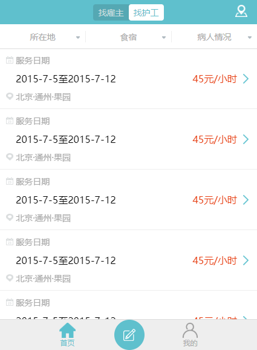

# 任务六、 护工列表页

## 今天完成的事情

1.规划任务六
2.完成基本界面编写

## 明天计划的事情

- [x] 限制最小宽度
- [x] 使用雪碧图替换当前的多张图片引入
- [x] 完成模拟下拉框编写
- [x] 屏幕过窄时，列表项左边文字被截断出现省略号
- [ ] 复习之前的代码规范，优化代码
- [ ] 查看验收标准
- [ ] 查看深度思考

## 遇到的问题

## 收获

### 一、任务六分析

1.页面原生CSS分块：

- header
  - 设计：
    - .topbar: fixed, 定高.可部分套用task3的topbar
      - tab*2(找雇主、找护工)位置center，location logo右绝对
    - .conditionbar: 暂定fixed, 定高
      - select*3故可定width百分比并使用flex， 小竖杠用border-left&first-child
      - 下拉内容简单字符填写
  - 实现：
    - .topic: topbar-switch需要将里面的a标签设置inline-block来撑高背景，并用active做激活样式.
- main
  - 设计：
    - section.service-list
      - div.service-item
        - p.item-label: img+span，无特效.
        - item-data：flex(justify-content: space-between), datedata & pricedata(red span+icon)
  - 实现：
    - 基本与设计相同
- div.bottombar: fixed, 定高. 可部分套用task3的topbar
  - 设计：
    - a*3,用flex主轴居中+交叉轴居中
    - 中间div.bottombar-middlebtn用background画圆，div.bottombar-middlebtn里面用img填图片，使其垂直水平居中
  - 实现：
    - 中间的按钮图片：一开始设line-height&vertical-align：middle, 以为居中了但效果靠下, 想起张鑫旭大神的[vertical-algn&line-height好基友](http://www.zhangxinxu.com/wordpress/2015/08/css-deep-understand-vertical-align-and-line-height/), 把div.bottombar-middlebtn的font-size改为0, 将文本中线和绝对中线重合，完成垂直居中.

    
    - CSS实现下拉菜单：设置好item-title的line-height, 新建ul>li, 使其display:none & absolute, 当hover时display:block，搞定.
    - 省略号：[关于文字内容溢出用点点点(…)省略号表示](https://www.zhangxinxu.com/wordpress/2009/09/%E5%85%B3%E4%BA%8E%E6%96%87%E5%AD%97%E5%86%85%E5%AE%B9%E6%BA%A2%E5%87%BA%E7%94%A8%E7%82%B9%E7%82%B9%E7%82%B9-%E7%9C%81%E7%95%A5%E5%8F%B7%E8%A1%A8%E7%A4%BA/)
      - 最简单：定width,设置white-space + text-overflow + overflow